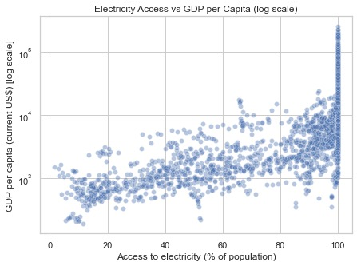
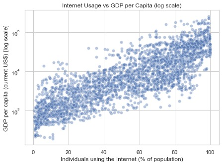

# What Really Drives Economic Prosperity? Insights from World Bank Data

  

<em>Figure 1: Electricity access versus GDP per capita (log scale)</em>

Understanding what drives economic prosperity is a core challenge for policymakers, development economists, and international organizations. Using publicly available World Bank indicators, this analysis explores which development factors are most closely associated with GDP per capita, how these relationships behave at different levels of development, and how predictive modeling can be used to simulate improvement scenarios.

The analysis focuses on four practical business questions and combines exploratory data analysis with predictive modeling to produce interpretable, real-world insights.

---

> **Data & Methodology Summary**
> - Source: World Bank Development Indicators  
> - Target variable: GDP per capita (log₁₀ USD)  
> - Correlation method: Spearman rank correlation  
> - Model evaluation: R², RMSE, MAE

--

## Question 1: Which development indicators are most strongly associated with GDP per capita?

  

<em>Figure 2: Spearman Correlation PLot</em>

To identify the strongest associations with GDP per capita, Spearman rank correlations were calculated between economic output and a set of development indicators. Spearman correlation was chosen because it captures monotonic relationships and is less sensitive to outliers and non-linear patterns than Pearson correlation.

All variables were analyzed on a logarithmic scale to account for skewed distributions and large cross-country differences. The results show that indicators related to infrastructure access, education, and health tend to have the strongest associations with GDP per capita, suggesting these factors play a central role in economic development.

---

## Question 2: Does increasing electricity access always lead to higher income levels?

  

<em>Figure 3: Electricity usage versus GDP per capita (log scale)</em>

While electricity access shows a strong overall relationship with GDP per capita, the scatter plot reveals an important non-linear pattern. At lower levels of access, increases in electricity coverage are associated with substantial gains in income. However, once electricity access approaches universal levels, the relationship begins to flatten.

This pattern suggests diminishing returns: electricity access is a critical enabling factor for growth in lower-income countries, but beyond a certain point, additional gains in income depend more heavily on other structural and institutional factors.

---

## Question 3: Which countries significantly over- or under-perform relative to expectations?

RMSE (log10 USD): 0.112356
MAE  (log10 USD): 0.064585
R2:              0.968776

To explore deviations from expected outcomes, residuals from the predictive model were examined. These residuals highlight countries whose actual GDP per capita is significantly higher or lower than what the model predicts based on observable development indicators.

Such deviations indicate that while development indicators explain a large portion of income variation, country-specific factors—such as governance, policy choices, historical context, or external shocks—also play an important role and are not fully captured by the model.

---

## Question 4: How accurately can GDP per capita be predicted, and what if key indicators improve?

The predictive model achieves strong overall performance:

- **R²:** 0.968  
- **RMSE (log₁₀ USD):** 0.112  
- **Typical multiplicative error:** approximately ×1.30  

These results indicate that the model explains most of the variation in GDP per capita across countries, while still allowing for meaningful uncertainty at the individual country level.

### Scenario simulation

Baseline predicted GDP per capita: $4,302
Improved predicted GDP per capita: $7,926
Predicted change: 84.3%

To illustrate how improvements in development indicators could translate into economic outcomes, a hypothetical scenario was constructed by incrementally increasing selected features while holding all others constant. Under this scenario, the model predicts a substantial increase in GDP per capita, corresponding to an improvement of approximately 84% relative to the baseline prediction.

This scenario is illustrative rather than causal and assumes no interaction effects or structural changes. Nevertheless, it demonstrates how predictive models can be used to explore the potential magnitude of development improvements.

---

## Conclusion

This analysis shows that basic infrastructure and human development indicators are strongly associated with economic prosperity, particularly at lower levels of development. However, the benefits of individual indicators tend to diminish as countries approach saturation, highlighting the need for broader, multi-dimensional growth strategies.

Predictive modeling provides a useful framework for understanding these relationships and for exploring hypothetical improvement scenarios, while also underscoring the importance of country-specific factors that extend beyond measurable indicators.
